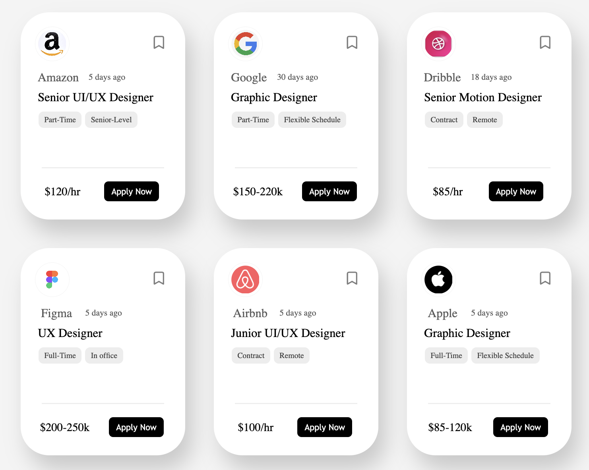

# Job Listing UI (React)

A clean and responsive Job Listing UI built using React. This project demonstrates dynamic rendering using props and JSON data, along with a structured and reusable component-based design.

---

## Features

* Dynamic card rendering using **map()**
* Data-driven UI using **JSON (array of objects)**
* Reusable **Card component**
* Clean UI layout using **Flexbox**
* Component-based structure with separate CSS files

---

## Concepts Used

* React Components
* Props (data passing)
* Array methods (`map`, `slice`)
* JSX (HTML in React)
* CSS Flexbox

---

## Project Structure

```bash id="9u7x2p"
src/
 ├── components/
 │    ├── box.jsx        # Card component
 │    ├── box.css        # Card styles
 │
 ├── App.jsx             # Main UI logic
 ├── App.css             # Layout styles
 ├── index.css           # Global styles
 ├── main.jsx            # Entry point
```

---

## Preview



---

## Tech Stack

* React (Vite)
* JavaScript (ES6)
* HTML (JSX)
* CSS3 (Flexbox)

---

## How It Works

* Job data is stored in a JSON-like structure (`cardsData`)
* Data is divided into rows using `slice()`
* Cards are rendered dynamically using `map()`
* Each card receives data through props

---

## Installation & Setup

```bash id="d2n8kx"
git clone https://github.com/hrjoshi1302/job-card-ui.git
cd job-card-ui
npm install
npm run dev
```

---

## Author

**Himal Joshi**

---
